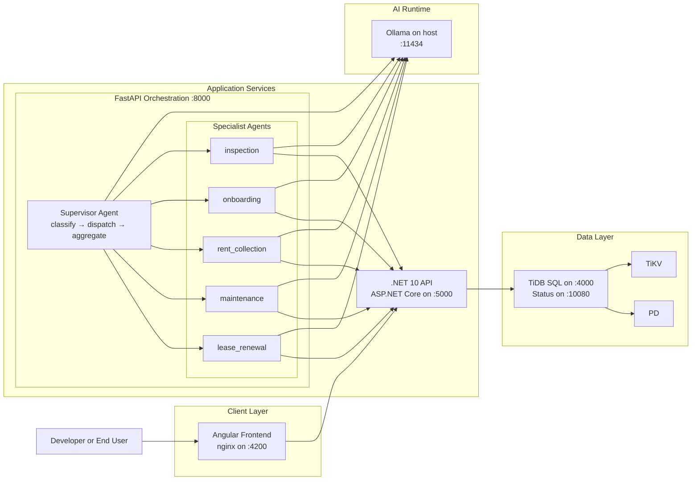
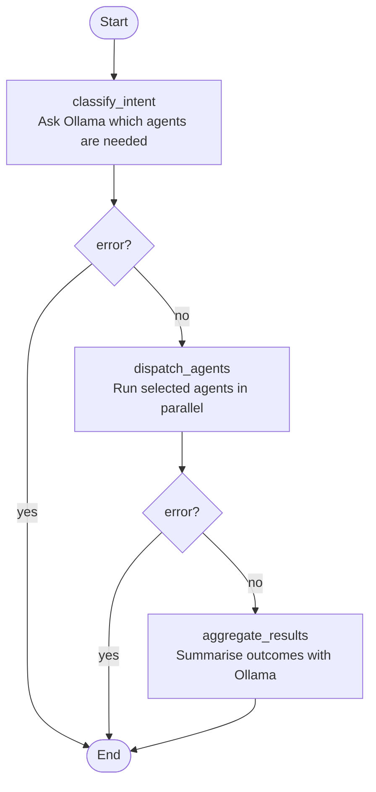
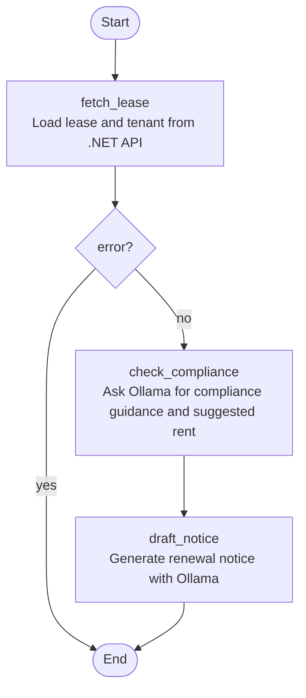
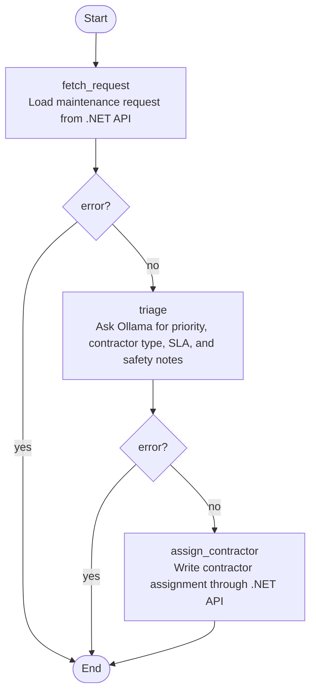
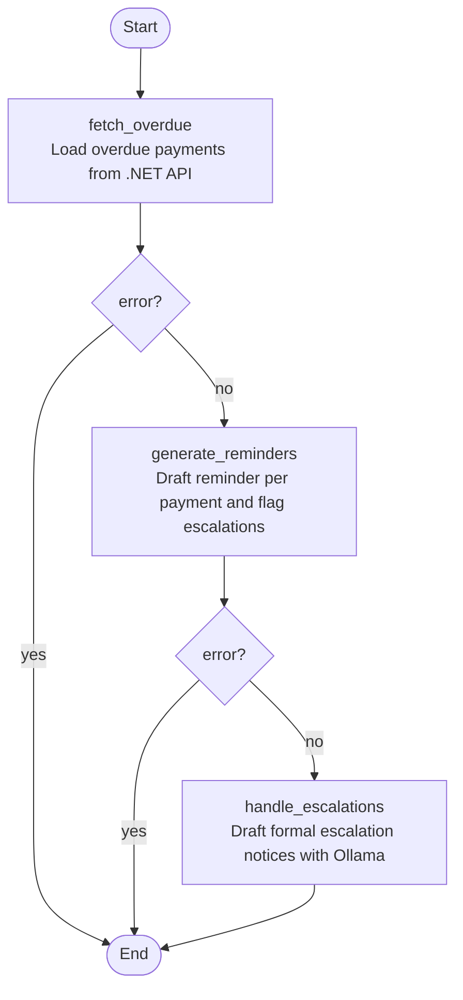
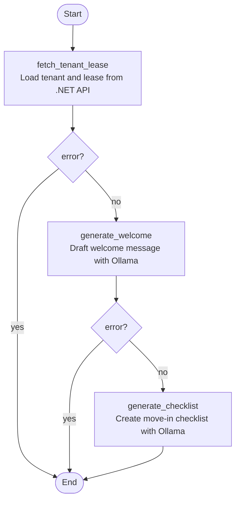
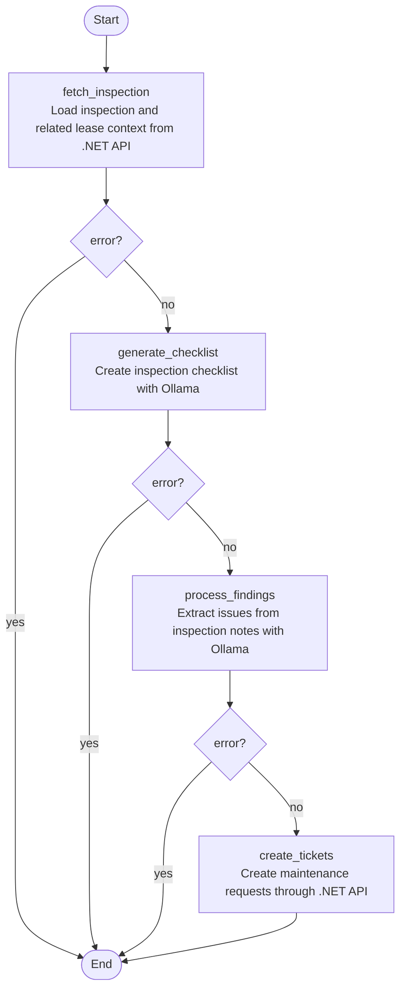
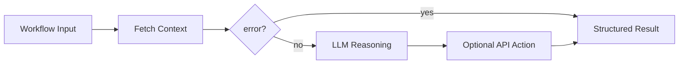
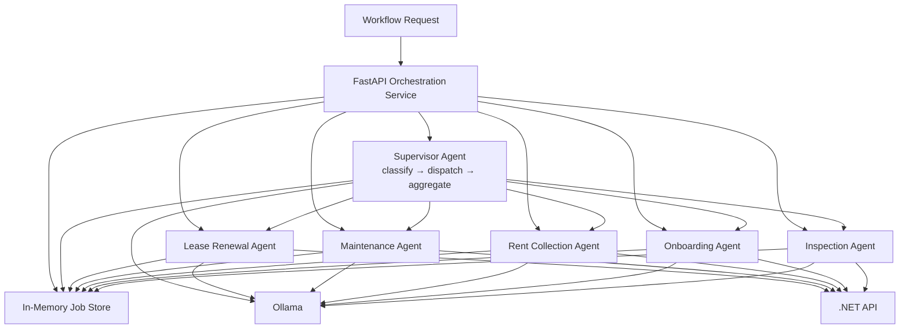

# Architecture

## Overview

The platform is composed of three application services and a local TiDB data tier:

- An Angular frontend for user interaction
- A .NET API for domain logic, persistence, and database initialization
- A FastAPI orchestration service for multi-agent workflow automation
- A TiDB cluster consisting of `pd`, `tikv`, and `tidb`

## Mermaid Diagram

## Runtime Notes

- The frontend is served from Docker via nginx and talks to the backend API over HTTP.
- The backend API owns database initialization and application persistence.
- The orchestration service coordinates specialized agents and calls the backend API for domain data and updates.
- The orchestration service calls Ollama on the host machine for LLM-powered workflow steps.
- TiDB runs as a small local cluster with `pd`, `tikv`, and `tidb` services defined in `docker-compose.yml`.

## Multi-Agent Orchestration

The orchestration service is a true multi-agent system. It has two tiers:

- A **supervisor agent** that accepts a plain-language request, uses Ollama to decide which specialist agents are needed, dispatches them in parallel, and returns a combined summary
- Five **specialist agents**, each owning one operational domain

The specialist agents are:

- `lease_renewal`: reviews a lease, checks compliance guidance, and drafts a renewal notice
- `maintenance`: triages a maintenance request and assigns a contractor recommendation
- `rent_collection`: reviews overdue payments, drafts reminders, and flags escalations
- `onboarding`: prepares welcome messaging and a move-in checklist for a tenant
- `inspection`: analyzes inspection notes and can create maintenance tickets from findings

All agents live in `orchestration/agents/` and are exposed through the FastAPI service in `orchestration/main.py`.

### Why This Is Multi-Agent

The system satisfies the two core properties of a multi-agent architecture:

- **Specialization**: each specialist agent has its own state model, prompts, and execution steps and is responsible for exactly one domain problem
- **Coordination**: the supervisor agent reasons about which specialists to invoke, fans out to them in parallel, and synthesizes their outputs into a single result

This is not a single monolithic agent making all decisions. It is a two-tier hierarchy: a coordinating supervisor at the top and domain-specific workers below.

### Execution Model

Each agent is built as a LangGraph state machine. A workflow typically follows this pattern:

1. Fetch structured business data from the .NET API
2. Use an LLM step to analyze, draft, classify, or summarize
3. Optionally call the .NET API again to persist a decision or trigger a side effect
4. Store the final result in the orchestration job store for polling

This design keeps the authoritative business data in the .NET API and TiDB, while the orchestration layer handles reasoning and drafting tasks.

### Shared Orchestration Responsibilities

The FastAPI orchestration service provides the common runtime for all agents:

- Accepts workflow requests over HTTP
- Creates a `job_id` for each request
- Runs the selected workflow in the background
- Tracks job state in an in-memory job store
- Returns results through `/jobs/{job_id}`

That means the service acts as the control plane, while the individual agents act as task-specific workers.

### Agent Interaction With Core Systems

Each agent uses three kinds of dependencies:

- Backend API: for authoritative lease, tenant, payment, maintenance, and inspection data
- Ollama: for prompt-based reasoning, drafting, triage, and summarization
- Internal workflow state: for passing intermediate results between graph nodes

This separation is important:

- The .NET API remains the system of record
- TiDB remains the persistence layer
- The orchestration agents remain stateless reasoners except for the temporary workflow state and in-memory job results

### Internal Agent Design

Internally, each workflow agent is a small directed graph built with LangGraph. Each graph has:

- A typed state object that carries inputs, fetched records, intermediate reasoning, and final outputs
- A set of graph nodes, where each node performs one step
- Conditional edges that short-circuit the workflow if an upstream step fails
- A final state snapshot that is written back to the orchestration job store

This means an agent is not just "one prompt." It is a sequence of explicit steps with state passed between them.

The implementation pattern is consistent across agents:

1. Start with request input such as `lease_id`, `request_id`, or `inspection_id`
2. Fetch authoritative records from the .NET API
3. Save those records into workflow state
4. Run one or more LLM-driven nodes using Ollama
5. Optionally call the .NET API to apply a change
6. Return a compact result object for the job status endpoint

### Common Node Types

Most agents are composed from a small set of reusable step styles:

- Fetch nodes: call the backend API and hydrate the workflow state
- Reasoning nodes: send structured prompts to Ollama and capture the response
- Extraction nodes: parse LLM output into structured fields such as `suggested_rent` or `recommended_contractor`
- Action nodes: call the .NET API to persist a decision or create records
- Error gates: stop the graph early if a previous node failed

The shared helper in `orchestration/agents/base.py` selects either the standard model or a faster model from Ollama depending on whether the step needs heavier drafting or lightweight classification.

## Agent Internals

### Supervisor Agent

The supervisor is a three-step graph that sits above all other agents:

1. `classify_intent`
2. `dispatch_agents`
3. `aggregate_results`

Internal behavior:

- `classify_intent` sends the plain-language request and the available context IDs to Ollama, which replies with a list of agent names to invoke
- `dispatch_agents` builds the initial state for each selected agent and runs them concurrently with `asyncio.gather`; agents for which required IDs are missing are silently skipped
- `aggregate_results` collects each agent's key outputs and asks Ollama to produce a short operational summary

State carried through the graph:

- `request`
- `context`
- `selected_agents`
- `agent_results`
- `summary`
- `error`

Important details:

- Agent selection is LLM-driven — the supervisor reasons about the request rather than matching keywords
- Selected agents run in parallel, so a supervisor job that covers three domains takes roughly as long as the slowest single agent
- Each agent result is reduced to its key fields before being stored in `agent_results`, keeping the job payload compact

### Lease Renewal Agent

The lease renewal agent is implemented as a three-step graph:

1. `fetch_lease`
2. `check_compliance`
3. `draft_notice`

Internal behavior:

- `fetch_lease` loads the lease from the .NET API and then loads the matching tenant using `tenantId`
- `check_compliance` sends lease details such as rent and end date to Ollama and asks for legal increase guidance plus a suggested rent
- The response is parsed to extract `SUGGESTED_RENT`
- `draft_notice` uses the lease, tenant, and compliance notes to generate a tenant-facing renewal notice

State carried through the graph:

- `lease_id`
- `lease`
- `tenant`
- `compliance_notes`
- `suggested_rent`
- `renewal_notice`
- `error`

Important detail:

- The .NET API remains authoritative for lease and tenant data
- Ollama is only used for compliance-oriented drafting and recommendation generation
- No database write happens in this graph by default; it returns a draft notice and recommendation

### Maintenance Agent

The maintenance agent is also a three-step graph:

1. `fetch_request`
2. `triage`
3. `assign_contractor`

Internal behavior:

- `fetch_request` retrieves the maintenance record from the backend API
- `triage` asks Ollama to validate priority, identify the needed contractor type, determine SLA expectations, and flag safety concerns
- The LLM output is parsed to extract `CONTRACTOR_TYPE`
- `assign_contractor` posts the recommended contractor back to the .NET API

State carried through the graph:

- `request_id`
- `request`
- `triage_result`
- `recommended_contractor`
- `assigned`
- `error`

Important detail:

- This agent includes a real side effect
- The final assignment is written through the .NET API rather than directly to the database

### Rent Collection Agent

The rent collection agent has a slightly richer pattern:

1. `fetch_overdue`
2. `generate_reminders`
3. `handle_escalations`

Internal behavior:

- `fetch_overdue` loads all overdue payments from the backend API
- `generate_reminders` loops through each overdue payment and asks Ollama to draft a short reminder notice
- During the same node, the agent calculates how many days overdue each payment is
- Payments more than 30 days overdue are added to an `escalations` list
- `handle_escalations` asks Ollama to draft a more formal final-warning style notice for escalated cases

State carried through the graph:

- `overdue_payments`
- `reminders`
- `escalations`
- `error`

Important detail:

- This agent currently produces reminders and escalation drafts in memory
- It does not yet persist reminder history or escalation state back into the backend
- That makes it useful for orchestration and drafting, but lighter on write-back behavior than the maintenance workflow

### Onboarding Agent

The onboarding agent is designed for content generation around a new tenant move-in:

1. `fetch_tenant_lease`
2. `generate_welcome`
3. `generate_checklist`

Internal behavior:

- `fetch_tenant_lease` retrieves both the tenant and the lease from the backend API
- `generate_welcome` drafts a welcome message using tenant name, unit, move-in date, and rent
- `generate_checklist` generates a detailed move-in checklist using the lease information

State carried through the graph:

- `tenant_id`
- `lease_id`
- `tenant`
- `lease`
- `welcome_message`
- `move_in_checklist`
- `error`

Important detail:

- This agent is read-heavy and content-focused
- It does not mutate backend state
- It is best understood as an AI document-preparation workflow backed by real tenant and lease data

### Inspection Agent

The inspection agent is the most analysis-oriented workflow:

1. `fetch_inspection`
2. `generate_checklist`
3. `process_findings`
4. `create_tickets`

Internal behavior:

- `fetch_inspection` retrieves the inspection record from the backend API
- If the inspection has a `leaseId`, the agent also loads the related lease so it can enrich the state with `unitNumber`
- `generate_checklist` creates an inspection checklist based on the inspection type
- `process_findings` reads the stored inspection notes and asks Ollama to extract maintenance issues line by line
- `create_tickets` loops through extracted findings and creates maintenance tickets through the backend API when a lease is present

State carried through the graph:

- `inspection_id`
- `inspection`
- `checklist`
- `findings`
- `maintenance_tickets_created`
- `error`

Important detail:

- This workflow mixes generation and operational follow-through
- It can transform unstructured inspection notes into structured maintenance work
- It is the clearest example in the system of an agent producing downstream business actions from AI interpretation

### Internal Graph Pattern

Across all agents, the graph structure follows the same control logic:

- The first node fetches required context
- A helper such as `has_error` checks whether the node failed
- If there is an error, the graph stops early
- If there is no error, execution continues to the next node
- The last node returns the enriched state to the orchestration runtime

That gives each workflow a predictable control path:

- deterministic data fetch
- constrained LLM reasoning
- optional API side effect
- structured result output

This pattern is what makes the multi-agent design maintainable. Each workflow can evolve independently without changing the overall orchestration shell.

### Workflow Routing Diagram

### Example End-To-End Flow

For a maintenance workflow, the execution path looks like this:

1. A client calls `POST /workflows/maintenance` on the orchestration service
2. The orchestration service creates a `job_id` and starts the maintenance agent in the background
3. The maintenance agent fetches the request details from the .NET API
4. The agent asks Ollama to classify urgency, contractor type, and safety implications
5. The agent calls the .NET API again to assign the recommended contractor
6. The orchestration service stores the result under the `job_id`
7. The client polls `GET /jobs/{job_id}` for completion

This same pattern is reused across the other workflows with different prompts, state objects, and side effects.

## Service Responsibilities

### Frontend

- Displays the property management UI
- Calls backend endpoints exposed by the .NET API

### .NET API

- Exposes REST endpoints
- Applies domain logic from the application and domain layers
- Initializes the database schema on startup
- Persists data into TiDB

### Orchestration Service

- Exposes workflow endpoints such as lease renewal, maintenance, rent collection, onboarding, and inspection
- Routes each workflow request to a specialized LangGraph-based agent
- Runs background jobs and stores job status in memory
- Uses the .NET API as its system-of-record interface
- Uses Ollama for AI-assisted workflow reasoning

### TiDB Cluster

- `pd`: cluster metadata and scheduling
- `tikv`: distributed key-value storage
- `tidb`: SQL layer used by the application
